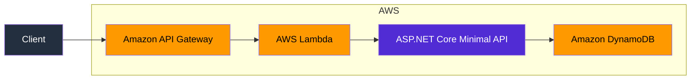

# Ghanavats .NET on AWS Starter Kit

A configurable .NET solution template for building and deploying serverless APIs on AWS.

Choose between a multi-project **Clean Architecture** solution and a single-application-project **Vertical Slice Architecture** solution. Both options provide the same practical starting point: an ASP.NET Core Minimal API deployed through AWS Lambda and API Gateway, with DynamoDB persistence and infrastructure defined using AWS CDK.

## Current status

This starter kit is actively maintained and under development.

The current version provides an opinionated but adaptable serverless foundation using:

- .NET and ASP.NET Core Minimal APIs
- AWS Lambda
- Amazon API Gateway
- Amazon DynamoDB
- AWS CDK with C#
- Clean Architecture or Vertical Slice Architecture

The project is intended to be a practical starting point rather than a finished application framework. APIs, project structure and deployment conventions may continue to evolve.

## Template usage

### Install locally

Clone the repository:

```bash
git clone https://github.com/ghanavat/dotnet-aws-starter-kit.git
cd dotnet-aws-starter-kit
```

Install the template from its content directory:

```bash
dotnet new install ./content/DotNetAws.StarterKit --force
```

Confirm that the template is available:

```bash
dotnet new list
```

### Create a Clean Architecture solution

Clean Architecture is the default:

```bash
dotnet new ghanavats_dotnet_aws_starter \
  --name Ghanavats.DotnetAws \
  --architecture clean-arc
```

Because it is the default, the architecture option can also be omitted:

```bash
dotnet new ghanavats_dotnet_aws_starter \
  --name Ghanavats.DotnetAws
```

### Create a Vertical Slice solution

```bash
dotnet new ghanavats_dotnet_aws_starter \
  --name Ghanavats.DotnetAws \
  --architecture vertical-slice
```

The supplied name replaces `Ghanavats.DotnetAws` throughout the generated solution, including project names, namespaces and filenames.

## Architecture options

Both architecture options generate the same AWS hosting and deployment foundation. The main difference is how the application code is organised.

### Clean Architecture

The Clean Architecture option generates a multi-project solution with explicit boundaries between presentation, application, domain, infrastructure and shared code.

```text
src/
├── Application/
│   └── Ghanavats.DotnetAws.UseCases/
├── Core/
│   └── Ghanavats.DotnetAws.Core/
├── Framework/
│   ├── Ghanavats.DotnetAws.IaC/
│   └── Ghanavats.DotnetAws.Infrastructure/
├── Presentation/
│   └── Ghanavats.DotnetAws.Api/
└── Shared/
    └── Ghanavats.DotnetAws.Shared/
```

This option is suitable when you want:

- Explicit project and dependency boundaries
- Separation between domain, application and infrastructure concerns
- Architecture tests that help protect those boundaries
- A structure that can grow across multiple teams or application areas

### Vertical Slice Architecture

The Vertical Slice option generates one application project containing the API and its feature implementation. The AWS CDK infrastructure remains in a separate project.

```text
src/
├── Framework/
│   └── Ghanavats.DotnetAws.IaC/
└── Presentation/
    └── Ghanavats.DotnetAws.Api/
        ├── DependencyInjection/
        ├── DomainEntities/
        ├── DynamoDbModels/
        └── Features/
            └── GetPersonDetails/
                ├── Repositories/
                ├── Requests/
                ├── Responses/
                └── Validators/
```

Clean Architecture-specific projects are not generated for this option. 
Feature code, persistence and registration are placed together in the API application.

This option is suitable when you want:

- Features organised by business capability
- Fewer projects and abstractions
- Related request, validation, handling and persistence code kept close together
- A simpler starting point for smaller APIs and teams

The Vertical Slice option is still structured and testable; 
it simply uses feature boundaries rather than project-layer boundaries.

## Included example

The generated solution contains a `GetPersonDetails` example that demonstrates an end-to-end request flow.

Depending on the selected architecture, the example is generated either across the Clean Architecture projects or as a feature inside the API project.

The example demonstrates:

- Minimal API endpoint registration
- Request and response models
- FluentValidation
- Result Pattern usage
- Dependency Injection
- DynamoDB persistence
- Domain-to-persistence model mapping
- Structured logging

It is intended as a reference implementation that can be replaced or extended with your own application features.

## AWS architecture



The application is deployed as a serverless API using AWS Lambda and API Gateway. DynamoDB is used as the persistence store.

## Features

- Selectable Clean Architecture or Vertical Slice Architecture
- ASP.NET Core Minimal API
- AWS Lambda hosting
- Amazon API Gateway integration
- Amazon DynamoDB persistence
- AWS CDK Infrastructure as Code
- API key and usage plan configuration
- OpenAPI documentation
- FluentValidation
- Ghanavats Result Pattern
- Global exception handling
- Application startup health checks
- Structured logging
- xUnit tests
- Architecture tests for the Clean Architecture option

## Build and test

Navigate to the generated solution directory and restore its dependencies:

```bash
dotnet restore
```

Build the solution:

```bash
dotnet build Ghanavats.DotnetAws.StarterKit.sln
```

Run the generated tests:

```bash
dotnet test Ghanavats.DotnetAws.StarterKit.sln
```

The solution should build successfully before attempting an AWS deployment.

## Run locally

Run the API project:

```bash
dotnet run \
  --project src/Presentation/Ghanavats.DotnetAws.Api/Ghanavats.DotnetAws.Api.csproj
```

Some operations require valid AWS credentials, a configured AWS Region and the expected DynamoDB resources.

For local development, review the generated `appsettings.json`, `appsettings.Development.json` and API project launch settings before calling AWS-dependent endpoints.

## AWS Lambda

The starter kit uses ASP.NET Core Minimal APIs with AWS Lambda hosting.

The API project is the Lambda entry point and is deployed using AWS CDK. During deployment, CDK builds and publishes the required Lambda assets.

Deployment assets are uploaded to the CDK bootstrap bucket. These assets are managed through the CDK bootstrap resources and are not part of the application stacks themselves.

## Lambda cold-start mitigation

AWS Lambda may create a new execution environment when a function is invoked for the first time or when additional instances are required to handle increased traffic. Starting the .NET runtime, building the ASP.NET Core application, configuring dependency injection and loading application code can add latency to these cold invocations.

The starter kit combines **AWS Lambda SnapStart** with application warm-up requests to reduce this startup work.

### SnapStart

The AWS CDK project enables SnapStart for published Lambda versions:

```csharp
SnapStart = SnapStartConf.ON_PUBLISHED_VERSIONS
```

When a new function version is published, Lambda initialises the execution environment and creates an encrypted snapshot of its memory and disk state. New execution environments can then resume from the cached snapshot instead of repeating the complete initialisation process.

API Gateway is connected to a published function version, allowing requests to benefit from the SnapStart-enabled version rather than invoking the unpublished `$LATEST` function.

SnapStart reduces cold-start latency, but it does not guarantee that every invocation will have identical latency or eliminate all restore work. See the [AWS Lambda SnapStart documentation](https://docs.aws.amazon.com/lambda/latest/dg/snapstart.html) for current availability, compatibility considerations and pricing.

### Pre-snapshot application warm-up

SnapStart captures the state created during normal application initialisation. However, some .NET code is not loaded or compiled until a request exercises it.

The API registers `LambdaWarmUpsExtension` during startup:

```csharp
builder.Services.AddLambdaWarmUps();
```

The extension uses `AddAWSLambdaBeforeSnapshotRequest` to send a representative request through the ASP.NET Core application before Lambda creates the snapshot:

```csharp
services.AddAWSLambdaBeforeSnapshotRequest(
    new HttpRequestMessage(
        HttpMethod.Get,
        $"api/people/{Guid.Empty}"));
```

This request helps initialise parts of the application that would otherwise be activated during the first real invocation, including:

- ASP.NET Core middleware and routing
- Minimal API endpoint execution
- Dependency injection resolution
- Feature handlers and validation
- Assembly loading and just-in-time compilation
- Request and response serialisation
- AWS persistence dependencies used by the feature

The resulting initialised state can then be included in the SnapStart snapshot.

This is a **pre-snapshot warm-up**, not a scheduled process that repeatedly invokes the Lambda function to keep an execution environment alive.

### Adding warm-up requests

Additional representative requests can be registered in `LambdaWarmUpsExtension`:

```csharp
internal static class LambdaWarmUpsExtension
{
    extension(IServiceCollection services)
    {
        public IServiceCollection AddLambdaWarmUps()
        {
            services.AddAWSLambdaBeforeSnapshotRequest(
                new HttpRequestMessage(
                    HttpMethod.Get,
                    $"api/people/{Guid.Empty}"));

            // Add other safe, representative warm-up requests here.

            return services;
        }
    }
}
```

Warm-up requests should:

- Exercise important or frequently used code paths
- Be safe to execute whenever a new function version is published
- Be read-only or idempotent
- Avoid creating business transactions or permanent data
- Avoid sending notifications or triggering downstream workflows
- Avoid capturing unique, sensitive or short-lived state in the snapshot
- Complete within Lambda’s snapshot initialisation limits

If an endpoint is renamed or removed, update its corresponding warm-up request. A warm-up should represent real application behaviour without producing unintended side effects.

AWS provides additional guidance for [.NET SnapStart runtime hooks](https://docs.aws.amazon.com/lambda/latest/dg/snapstart-runtime-hooks-dotnet.html) and recommends invoking representative handlers before snapshot creation to reduce assembly loading and JIT compilation during restored invocations.

## Amazon API Gateway

API Gateway is provisioned and configured through AWS CDK.

Lambda proxy integration forwards incoming requests to the ASP.NET Core application, where routing is handled by the Minimal API endpoints.

The current API Gateway configuration includes:

- Lambda proxy integration
- Automatic stage deployment
- API key support
- Usage plan configuration
- Request throttling through the usage plan

## Amazon DynamoDB

The starter kit uses the AWS SDK `DynamoDBContext` implementation for persistence.

AWS CDK provisions a DynamoDB table with a straightforward partition-key design. The current implementation intentionally keeps the data model small so that the request flow and deployment infrastructure remain easy to understand.

The following topics are currently outside the starter kit’s scope:

- Composite key designs
- Sort-key access patterns
- Global Secondary Indexes
- Local Secondary Indexes
- Single-table design
- Advanced DynamoDB modelling
- Production migration and data-management strategies

These concerns should be designed according to the access patterns and operational requirements of the application being built.

## Infrastructure as Code

Infrastructure is defined using AWS CDK and C#.

The CDK application follows a multi-stack structure to separate infrastructure responsibilities. It currently provisions and connects:

- AWS Lambda
- Amazon API Gateway
- Amazon DynamoDB
- IAM roles, permissions and integrations

The goal is to make the generated application deployable without requiring developers to create its core resources manually through the AWS Console.

## Deploying to AWS

### Prerequisites

Install the following tools before deploying:

- A supported .NET SDK
- Docker
- A supported Node.js LTS release
- AWS CLI
- AWS CDK CLI

Verify the installations:

```bash
dotnet --version
docker --version
node --version
aws --version
cdk --version
```

Install AWS CDK globally if required:

```bash
npm install --global aws-cdk
```

### Configure AWS credentials

Configure an AWS profile and default Region:

```bash
aws configure
```

Confirm the active AWS identity:

```bash
aws sts get-caller-identity
```

You should understand which AWS account and Region are active before deploying resources.

### Open the CDK project

From the generated solution directory:

```bash
cd src/Framework/Ghanavats.DotnetAws.IaC
```

Confirm that the CDK application can be synthesised:

```bash
cdk synth
```

### Bootstrap the AWS environment

Before the first deployment to an AWS account and Region, bootstrap the environment:

```bash
cdk bootstrap
```

CDK bootstrap creates supporting AWS resources, including an S3 bucket used for deployment assets.

Bootstrapping is normally required only once for each AWS account and Region. Bootstrap resources are managed separately and are not removed by `cdk destroy`.

### Deploy the stacks

Deploy all application stacks:

```bash
cdk deploy --all
```

Review the proposed infrastructure changes before approving the deployment.

The deployment provisions the application’s Lambda function, API Gateway configuration, DynamoDB table and required IAM permissions. CDK outputs provide information about the deployed resources, including the API endpoint where configured.

### Destroy the stacks

Remove the application infrastructure:

```bash
cdk destroy --all
```

Review the resources selected for deletion before confirming.

Some retained data or CDK bootstrap resources may remain after the application stacks are destroyed.

> AWS resources can incur charges. Review the generated infrastructure and your AWS account before deployment, and remove resources that are no longer required.

## API key access

The starter kit configures an API key and usage plan in Amazon API Gateway.

API Gateway validates the API key before forwarding an accepted request to Lambda. The ASP.NET Core application does not validate or manage API Gateway keys itself.

Clients calling a protected method must send the key using the `x-api-key` request header:

```http
x-api-key: your-api-key
```

API keys and usage plans can provide basic client identification, quotas and throttling. They are not a replacement for user authentication or application authorisation.

For applications requiring user identity, tokens, roles or permissions, integrate a suitable identity provider such as Amazon Cognito or another standards-based provider.

## Current scope

### Implemented

- Selectable Clean Architecture and Vertical Slice Architecture
- Advanced .NET Template Engine configuration
- ASP.NET Core Minimal API
- AWS Lambda deployment
- API Gateway integration
- DynamoDB integration
- AWS CDK infrastructure
- OpenAPI documentation
- FluentValidation
- Result Pattern integration
- Global exception handling
- Health checks
- Unit testing
- Clean Architecture boundary tests

### Planned and under consideration

- CI/CD pipeline examples
- Authentication and authorisation
- Additional Vertical Slice examples
- Advanced DynamoDB access patterns
- Event-driven architecture examples
- Additional AWS service integrations
- Expanded observability guidance
- Automated template-generation verification

## Disclaimer

This project is a starting point, not a complete production-ready platform.

Before using it in production, review and adapt:

- Security and identity requirements
- IAM permissions
- Data protection and retention
- Observability and alerting
- Failure handling and resilience
- Deployment and rollback strategy
- Cost controls
- Testing requirements
- Compliance obligations

The generated code is intended to be understood, changed and owned by the team building the application.

## Feedback

Constructive feedback, bug reports and contributions are welcome through the [GitHub repository](https://github.com/ghanavat/dotnet-aws-starter-kit).
